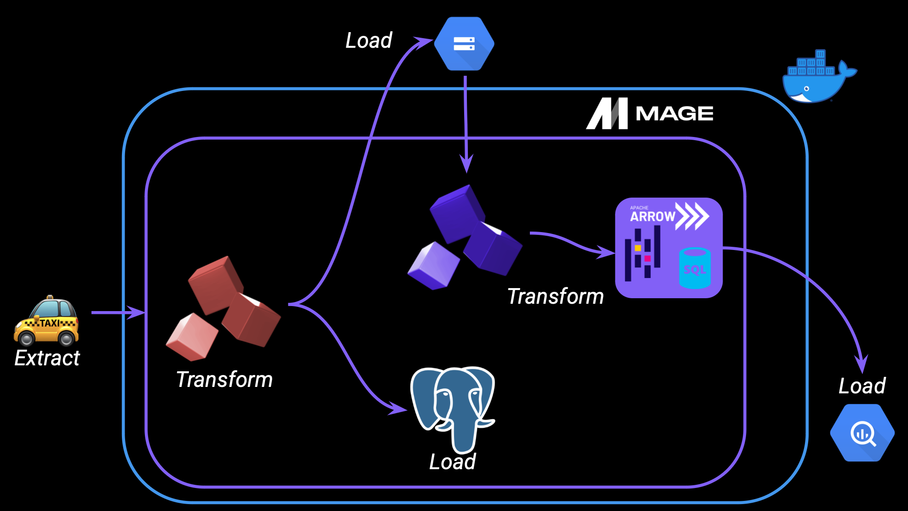
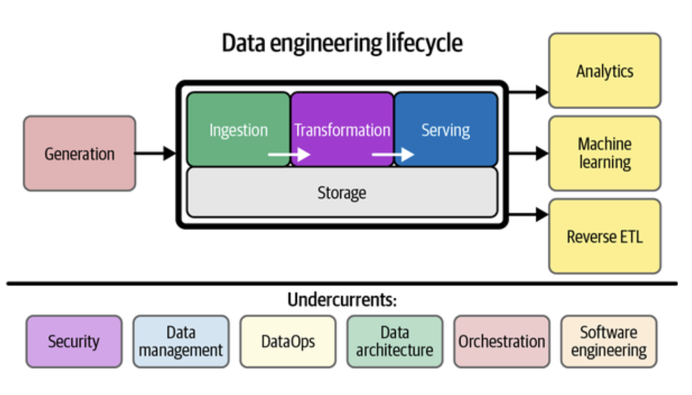
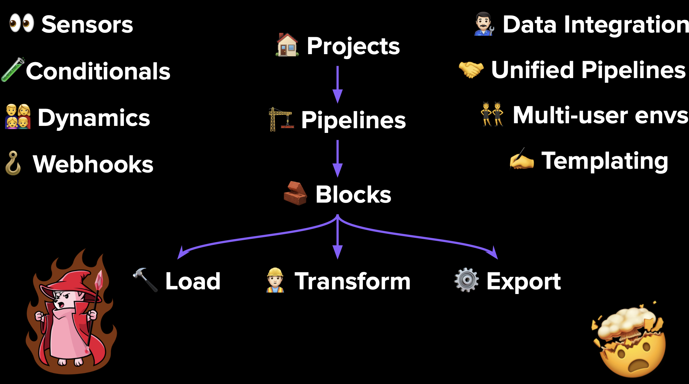
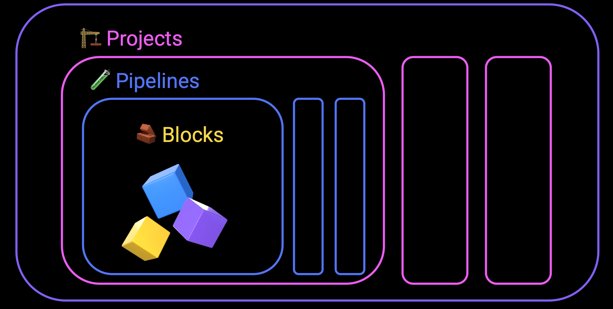
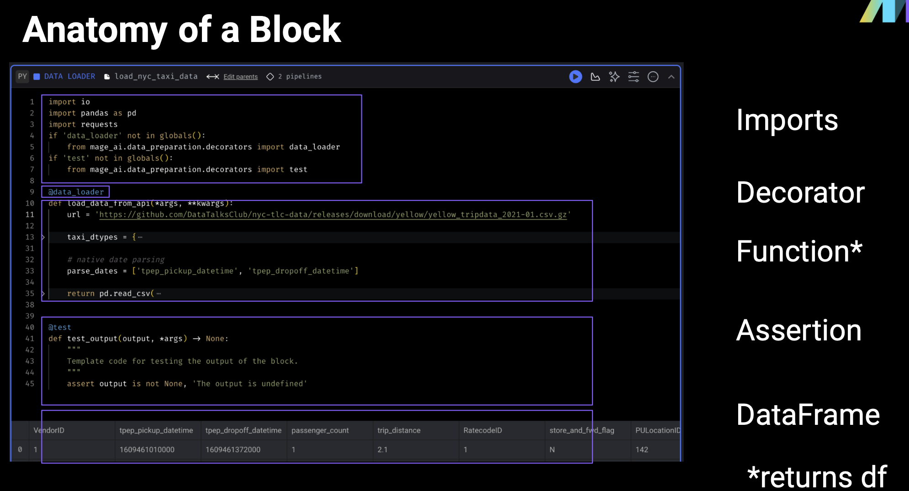

## 2.2.1 What is Orchestration?

### Extract
Pull data from a source (API— NYC taxi dataset)
### Transform
Data cleaning, transformation, and partitioning.
### Load
API to Mage, Mage to Postgres, GCS, BigQuery.

### Orchestration
A large part of data engineering is extracting, transforming, and loading data between sources. Orchestration is a process of dependency management, facilitated through automation. The data orchestrator manages scheduling, triggering, monitoring, and even resource allocation.
- Every workflow requires sequential steps. (A French press with cold water will only brew disappointment)
- Steps 🟰 tasks
- Workflows 🟰 DAGs (directed acyclic graphs) or Pipelines

### Orchestrator handles
- Workflow management
- Automation
- Error handling 
- Recovery
- Monitoring, alerting
- Resource optimization
- Observability
- Debugging
- Compliance/Auditing

## 2.2.2 What is Mage?
An open-source pipeline tool for orchestrating transforming, and integrating data

Hybrid environment
 - Use our GUI for interactive development (or don’t, I like VSCode)
- Use blocks as testable, reusable pieces of code.
Improved DevEx
- Code and test in parallel.
- Reduce your dependencies, switch tools less, be efficient.

Best code practices.
- In-line testing and debugging. Familiar, notebook-style format
- Fully-featured observability. Transformation in one place: dbt models, streaming, & more.
- DRY principles. No more DAGs with duplicate functions and weird imports DEaaS.

### Projects
- A project forms the basis for all the work you can do in Mage— you can think of it like a GitHub repo. 
- It contains the code for all of your pipelines, blocks, and other assets.
- A Mage instance has one or more projects
### Pipelines
- A pipeline is a workflow that executes some data operation— maybe extracting, transforming, and loading data from an API. They’re also called DAGs on other platforms
- In Mage, pipelines can contain Blocks (written in SQL, Python, or R) and charts. 
- Each pipeline is represented by a YAML file in the “pipelines” folder of your project.
### Blocks
- A block is a file that can be executed independently or within a pipeline. 
- Together, blocks form Directed Acyclic Graphs (DAGs), which we call pipelines. 
- A block won’t start running in a pipeline until all its upstream dependencies are met.
- Blocks are reusable, atomic pieces of code that perform certain actions. 
- Changing one block will change it everywhere it’s used, but don’t worry, it’s easy to detach blocks to separate instances if necessary.
- Blocks can be used to perform a variety of actions, from simple data transformations to complex machine learning models.

