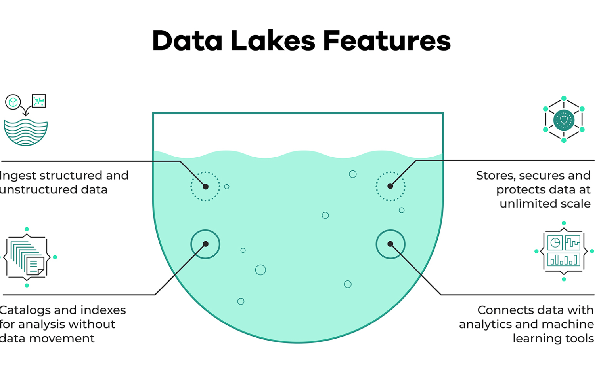

## 2.2.1 What is Orchestration?


### Extract
Pull data from a source (API— NYC taxi dataset)
### Transform
Data cleaning, transformation, and partitioning.
### Load
API to Mage, Mage to Postgres, GCS, BigQuery.

### Orchestration
A large part of data engineering is extracting, transforming, and loading data between sources. Orchestration is a process of dependency management, facilitated through automation. The data orchestrator manages scheduling, triggering, monitoring, and even resource allocation.
- Every workflow requires sequential steps. (A French press with cold water will only brew disappointment)
- Steps 🟰 tasks
- Workflows 🟰 DAGs (directed acyclic graphs) or Pipelines


### Orchestrator handles
- Workflow management
- Automation
- Error handling 
- Recovery
- Monitoring, alerting
- Resource optimization
- Observability
- Debugging
- Compliance/Auditing

## 2.2.2 What is Mage?
An open-source pipeline tool for orchestrating transforming, and integrating data


Hybrid environment
 - Use our GUI for interactive development (or don’t, I like VSCode)
- Use blocks as testable, reusable pieces of code.
Improved DevEx
- Code and test in parallel.
- Reduce your dependencies, switch tools less, be efficient.

Best code practices.
- In-line testing and debugging. Familiar, notebook-style format
- Fully-featured observability. Transformation in one place: dbt models, streaming, & more.
- DRY principles. No more DAGs with duplicate functions and weird imports DEaaS.


### Projects
- A project forms the basis for all the work you can do in Mage— you can think of it like a GitHub repo. 
- It contains the code for all of your pipelines, blocks, and other assets.
- A Mage instance has one or more projects
### Pipelines
- A pipeline is a workflow that executes some data operation— maybe extracting, transforming, and loading data from an API. They’re also called DAGs on other platforms
- In Mage, pipelines can contain Blocks (written in SQL, Python, or R) and charts. 
- Each pipeline is represented by a YAML file in the “pipelines” folder of your project.
### Blocks
- A block is a file that can be executed independently or within a pipeline. 
- Together, blocks form Directed Acyclic Graphs (DAGs), which we call pipelines. 
- A block won’t start running in a pipeline until all its upstream dependencies are met.
- Blocks are reusable, atomic pieces of code that perform certain actions. 
- Changing one block will change it everywhere it’s used, but don’t worry, it’s easy to detach blocks to separate instances if necessary.
- Blocks can be used to perform a variety of actions, from simple data transformations to complex machine learning models.


## Configuring Postgres
```yaml
version: '3'
services:
  magic:
    image: mageai/mageai:latest
    command: mage start ${PROJECT_NAME}
    env_file:
      - .env
    build:
      context: .
      dockerfile: Dockerfile
    environment:
      USER_CODE_PATH: /home/src/${PROJECT_NAME}
      POSTGRES_DBNAME: ${POSTGRES_DBNAME}
      POSTGRES_SCHEMA: ${POSTGRES_SCHEMA}
      POSTGRES_USER: ${POSTGRES_USER}
      POSTGRES_PASSWORD: ${POSTGRES_PASSWORD}
      POSTGRES_HOST: ${POSTGRES_HOST}
      POSTGRES_PORT: ${POSTGRES_PORT}
    ports:
      - 6789:6789
    volumes:
      - .:/home/src/
      - ~/Documents/secrets/personal-gcp.json:/home/src/personal-gcp.json
    restart: on-failure:5
  postgres:
    image: postgres:14
    restart: on-failure
    container_name: ${PROJECT_NAME}-postgres
    env_file:
      - .env
    environment:
      POSTGRES_DB: ${POSTGRES_DBNAME}
      POSTGRES_USER: ${POSTGRES_USER}
      POSTGRES_PASSWORD: ${POSTGRES_PASSWORD}
    ports:
      - "${POSTGRES_PORT}:5432"
```

Path where mage manages all connections "02-workflow-orchestration/mage-zoomcamp/magic-zoomcamp/io_config.yaml" for example we
define new connection profile:
```yaml
dev:
  # PostgresSQL https://docs.getdbt.com/reference/dbt-jinja-functions/env_var
  POSTGRES_CONNECT_TIMEOUT: 10
  POSTGRES_DBNAME: "{{ env_var('POSTGRES_DBNAME') }}"
  POSTGRES_SCHEMA: "{{ env_var('POSTGRES_SCHEMA') }}"
  POSTGRES_USER: "{{ env_var('POSTGRES_USER') }}"
  POSTGRES_PASSWORD: "{{ env_var('POSTGRES_PASSWORD') }}"
  POSTGRES_HOST: "{{ env_var('POSTGRES_HOST') }}"
  POSTGRES_PORT: "{{ env_var('POSTGRES_PORT') }}"
```

In mage GUI:
1. Create new pipeline
2. Create new SQL Loader
3. Define connection to Postgres
4. Define profile as dev
5. Define SQL query

## 2.2.3 ETL: API to Postgres
1. Create new pipeline
2. Create Python API loader
```python
@data_loader
def load_data_from_api(*args, **kwargs):
    url = 'https://github.com/DataTalksClub/nyc-tlc-data/releases/download/yellow/yellow_tripdata_2021-01.csv.gz'
    
    taxi_dtypes = {
                    'VendorID': pd.Int64Dtype(),
                    'passenger_count': pd.Int64Dtype(),
                    'trip_distance': float,
                    'RatecodeID':pd.Int64Dtype(),
                    'store_and_fwd_flag':str,
                    'PULocationID':pd.Int64Dtype(),
                    'DOLocationID':pd.Int64Dtype(),
                    'payment_type': pd.Int64Dtype(),
                    'fare_amount': float,
                    'extra':float,
                    'mta_tax':float,
                    'tip_amount':float,
                    'tolls_amount':float,
                    'improvement_surcharge':float,
                    'total_amount':float,
                    'congestion_surcharge':float
                }

    # native date parsing 
    parse_dates = ['tpep_pickup_datetime', 'tpep_dropoff_datetime']

    return pd.read_csv(url, sep=',', compression='gzip', dtype=taxi_dtypes, parse_dates=parse_dates)
```
3. Create Python transformer
```python
@transformer
def transform(data, *args, **kwargs):
    print(f"Preprocessing rows with zero passengers: { data[['passenger_count']].isin([0]).sum() }")

    return data[data['passenger_count'] > 0]

@test
def test_output(output, *args) -> None:
    assert output[ 'passenger_count'].isin([0]).sum() === 0, 'There are rides with zero passengers'
```
4. Create Postgres Python exporter
```python
from mage_ai.settings.repo import get_repo_path
from mage_ai.io.config import ConfigFileLoader
from mage_ai.io.postgres import Postgres
from pandas import DataFrame
from os import path

if 'data_exporter' not in globals():
    from mage_ai.data_preparation.decorators import data_exporter


@data_exporter
def export_data_to_postgres(df: DataFrame, **kwargs) -> None:
    """
    Template for exporting data to a PostgreSQL database.
    Specify your configuration settings in 'io_config.yaml'.

    Docs: https://docs.mage.ai/design/data-loading#postgresql
    """
    schema_name = 'ny_taxi'  # Specify the name of the schema to export data to
    table_name = 'yellow_cab_data'  # Specify the name of the table to export data to
    config_path = path.join(get_repo_path(), 'io_config.yaml')
    config_profile = 'dev'

    with Postgres.with_config(ConfigFileLoader(config_path, config_profile)) as loader:
        loader.export(
            df,
            schema_name,
            table_name,
            index=False,  # Specifies whether to include index in exported table
            if_exists='replace',  # Specify resolution policy if table name already exists
        )

```
5. Create SQL loader
```sql
SELECT * FROM ny_taxi.yellow_cab_data LIMIT 5;
```

## 2.2.4 - Configuring GCP
Create Project.
Create Cloude Storage bucket.
Create Service Account and select roles: OWNER.
Create Service Account key and download json file.
In 02-workflow-orchestration/mage-zoomcamp/magic-zoomcamp/io_config.yaml specify keys
```yaml
GOOGLE_SERVICE_ACC_KEY_FILEPATH: "/path/to/your/service/account/key.json"
```
Create python data loader with google cloud storage and define credentials of bucket
```python
from mage_ai.settings.repo import get_repo_path
from mage_ai.io.config import ConfigFileLoader
from mage_ai.io.google_cloud_storage import GoogleCloudStorage
from os import path
if 'data_loader' not in globals():
    from mage_ai.data_preparation.decorators import data_loader
if 'test' not in globals():
    from mage_ai.data_preparation.decorators import test


@data_loader
def load_from_google_cloud_storage(*args, **kwargs):
    """
    Template for loading data from a Google Cloud Storage bucket.
    Specify your configuration settings in 'io_config.yaml'.

    Docs: https://docs.mage.ai/design/data-loading#googlecloudstorage
    """
    config_path = path.join(get_repo_path(), 'io_config.yaml')
    config_profile = 'default'

    bucket_name = ''
    object_key = 'titanic_clean.csv'

    return GoogleCloudStorage.with_config(ConfigFileLoader(config_path, config_profile)).load(
        bucket_name,
        object_key,
    )


@test
def test_output(output, *args) -> None:
    """
    Template code for testing the output of the block.
    """
    assert output is not None, 'The output is undefined'

```
## 2.2.4 - ETL: API to GCS
1. Create new pipeline add previous loader and transformer and create new python GCP exporter
```python
object_key = 'nyc_taxi_data.parquet'
```
You can write big amount of data into single parquet file so we need a partitioning
```python
import pyarrow as pa
import pyarrow.parquet as pq
import os


if 'data_exporter' not in globals():
    from mage_ai.data_preparation.decorators import data_exporter

os.environ['GOOGLE_APPLICATION_CREDENTIALS'] = "/home/src/..."
bucket_name = ''
project_id = ''
table_name = 'nyc_taxi_data'

root_path = f'{bucket_name}/{table_name}'

@data_exporter
def export_data(data, *args, **kwargs):
    data['tpep_pickup_date'] = data['tpep_pickup_datetime'].dt.date

    table = pa.Table.from_pandas(data)
    gcs = pa.fs.GcsFileSystem()
    pq.write_to_dataset(
        table,
        root_path=root_path,
        partition_cols=['tpep_pickup_date'],
        filesystem=gcs
    )
```

## 2.2.5 - ETL: GCS to BigQuery
1. Create new pipeline add previous loader and transformer and create new python GCP exporter
```python
from mage_ai.settings.repo import get_repo_path
from mage_ai.io.config import ConfigFileLoader
from mage_ai.io.google_cloud_storage import GoogleCloudStorage
from os import path
if 'data_loader' not in globals():
    from mage_ai.data_preparation.decorators import data_loader
if 'test' not in globals():
    from mage_ai.data_preparation.decorators import test


@data_loader
def load_from_google_cloud_storage(*args, **kwargs):
    """
    Template for loading data from a Google Cloud Storage bucket.
    Specify your configuration settings in 'io_config.yaml'.

    Docs: https://docs.mage.ai/design/data-loading#googlecloudstorage
    """
    config_path = path.join(get_repo_path(), 'io_config.yaml')
    config_profile = 'default'

    bucket_name = ''
    object_key = 'titanic_clean.csv'

    return GoogleCloudStorage.with_config(ConfigFileLoader(config_path, config_profile)).load(
        bucket_name,
        object_key,
    )

```
2. Do column normalization in python transformer
```python
if 'transformer' not in globals():
    from mage_ai.data_preparation.decorators import transformer
if 'test' not in globals():
    from mage_ai.data_preparation.decorators import test


@transformer
def transform(data, *args, **kwargs):
    data.columns = (data.columns
                    .str.replace(' ', '_')
                    .str.lower()
    )

    return data
```
3. Create new python BigQuery exporter
```sql
SELECT * FROM {{ df_1 }}
```

Now we can create scheduler:
1. Go to triggers
2. Create
3. Enable

## 2.2.6a - Parameterized Execution
Process of loading data sets depends on some parameters. For example, we can load data for specific date range.

We can access paramaers in kwargs in python blocks.
```python
@data_exporter
def export_data_to_google_cloud_storage(df: DataFrame, **kwargs) -> None:
    """
    Template for exporting data to a Google Cloud Storage bucket.
    Specify your configuration settings in 'io_config.yaml'.

    Docs: https://docs.mage.ai/design/data-loading#googlecloudstorage
    """

    now = kwargs.get('execution_date')
    print(now)
    print(now.strftime("%Y/%m/%d"))
```
default
```json
{'env': 'dev', 'execution_date': datetime.datetime(2024, 2, 4, 9, 59, 30, 616575), 'interval_end_datetime': None, 'interval_seconds': None, 'interval_start_datetime': datetime.datetime(2024, 2, 4, 9, 59, 30, 616575), 'interval_start_datetime_previous': None, 'event': {}, 'logger': <Logger export_taxi_to_gcp_parameter_test (INFO)>, 'configuration': {}, 'context': {}, 'pipeline_uuid': 'load_to_gcp_cparametrrized', 'block_uuid': 'export_taxi_to_gcp_parameter'}
```
### incremental data
```python
@data_exporter
def export_data_to_google_cloud_storage(df: DataFrame, **kwargs) -> None:
    """
    Template for exporting data to a Google Cloud Storage bucket.
    Specify your configuration settings in 'io_config.yaml'.

    Docs: https://docs.mage.ai/design/data-loading#googlecloudstorage
    """

    now = kwargs.get('execution_date')

    now_fpath = now.strftime("%Y/%m/%d")
    config_path = path.join(get_repo_path(), 'io_config.yaml')
    config_profile = 'default'

    bucket_name = ''
    object_key = f'{now_fpath}/daily-trips.parquet'
    print(object_key)

    GoogleCloudStorage.with_config(ConfigFileLoader(config_path, config_profile)).export(
        df,
        bucket_name,
        object_key,
    )
```

## 2.2.6b - Backfills
Backfilling - process of running a pipeline for historical date to refill data sets.


## 2.2.7 - Deployment
Prerequisites:
- Terraform
- GC SDK CLI
- GC Permissions
- Mage terraform template
###  Google Cloud Permissions
Service account permissions:
- Artifact Registry Reader
- Artifact Registry Writer
- Cloud Run Developer
- Cloud SQL Admin
- Service Account Token Creator
###
check gcloud cli
```bash
gcloud auth list
```
list buckets
```bash
gcloud storage ls
```

fetch templates
```bash
git clone https://github.com/mage-ai/mage-ai-terraform-templates
cd gcp
```

You have to change the files of Terraform. You need to go to the GCP folder on the repo and change the variables.tf and main files like we have done on week1-2.
Substitute the variables of the variables.tf for the right ones:
project (with your GCP project_id)
postgres user (.env file)
Add the credentials (your service account)
variable "credentials" {
  description = "My Credentials"
  default     = "path_to_the_credentials_of_your_service_account_that_you_downloaded"
}
zone and region (if applied)
Add the credentials in the main.tf on the properties like we did last week.
provider "google" {
  credentials = file(var.credentials)
  project = var.project_id
  region  = var.region
  zone    = var.zone
}
Don't forget to activate the service account:
gcloud auth activate-service-account --key-file $var_credentials
If you are in the GCP free trial you will face a problem with the load_balancer, in the FAQ (2.2.7.d GCP Load Balancer Problem (Security Policies quota)) you have already the solution for it.

It appears that the video DE Zoomcamp 2.2.7 is missing  the actual deployment of Mage using Terraform to GCP. The steps for the deployment were not covered in the video.
I successfully deployed it and wanted to share some key points:
In variables.tf, set the project_id default value to your GCP project ID.
 2 . Enable the Cloud Filestore API:
           Visit the Google Cloud Console.
Navigate to "APIs & Services" > "Library."
Search for "Cloud Filestore API."
Click on the API and enable it.
To perform the deployment:
terraform init
terraform apply
Please note that during the terraform apply step, Terraform will prompt you to enter the PostgreSQL password. After that, it will ask for confirmation to proceed with the deployment. Review the changes, type 'yes' when prompted, and press Enter.

2.2.7.d GCP Load Balancer Problem (Security Policies quota)
If you are on the free trial account on GCP you will face this issue when trying to deploy the infrastructures with terraform. This service is not available for this kind of account.
The solution I found was to delete the load_balancer.tf file and to comment or delete the rows that differentiate it on the main.tf file. After this just do terraform destroy to delete any infrastructure created on the fail attempts and re-run the terraform apply.
Code on main.tf to comment/delete:
Line 166, 167, 168

Line 148
File Path: Cannot save file into a non-existent directory: 
