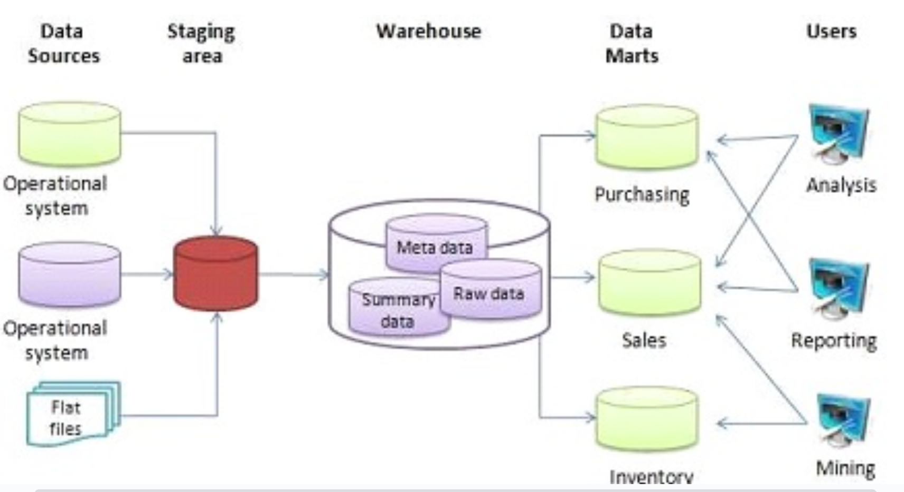
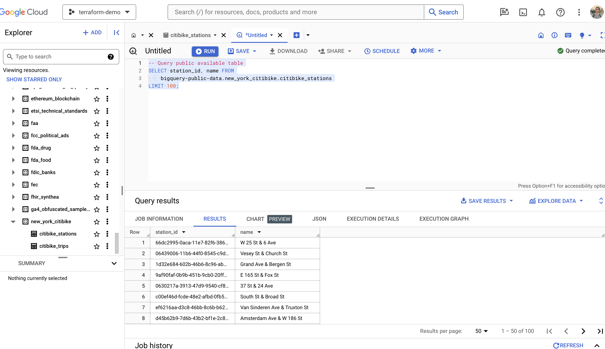
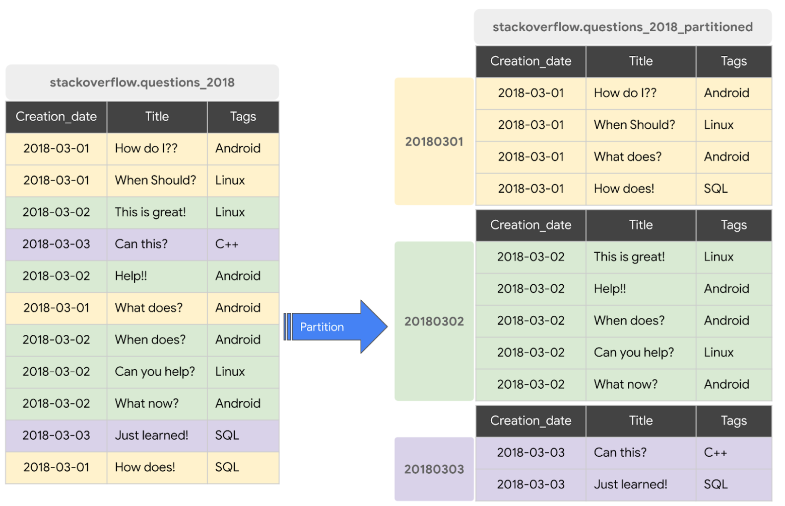
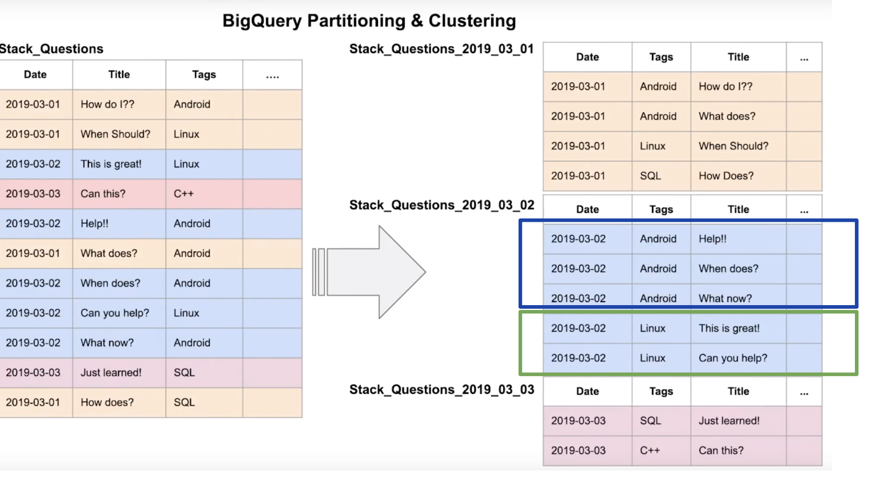
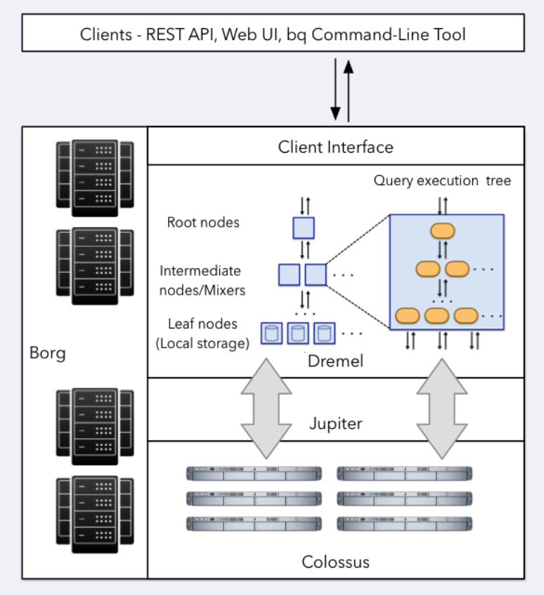
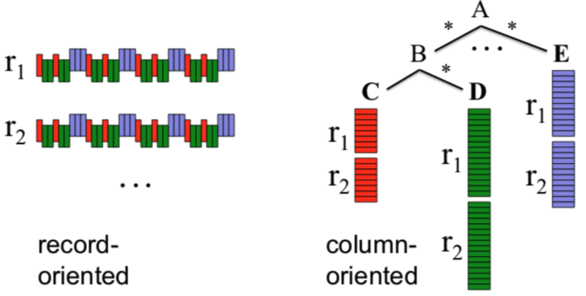
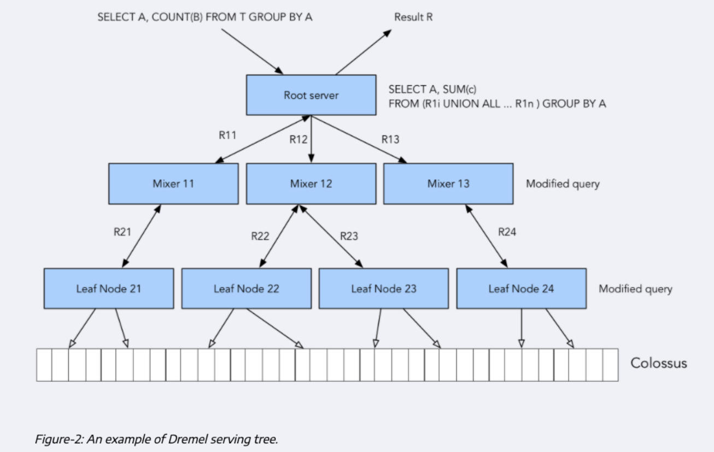

### Data Warehouse and BigQuery

#### OLAP vs OLTP
- OLAP (Online Analytical Processing) is a category of software tools that provides analysis of data for business decisions.
- OLTP (Online Transaction Processing) is a class of software programs capable of supporting transaction-oriented applications on the Internet.

OLTP
Purpose: Control and run essential business operations in real time
Data updates: Short, fast updates initiated by user
Database design: Normalized databases for efficiency
Space requirements: Generally small if historical data is archived
Backup and recovery: Regular backups required to ensure business continuity and meet legal and governance requirements
Productivity: Increases productivity of end users
Data view: Lists day-to-day business transactions
User examples: Customer-facing personnel, clerks, online shoppers

OLAP
Purpose: Plan, solve problems, support decisions, discover hidden insights
Data updates: Data periodically refreshed with scheduled, long-running batch jobs
Database design: Denormalized databases for analysis
Space requirements: Generally large due to aggregating large datasets
Backup and recovery: Lost data can be reloaded from OLTP database as needed in lieu of regular backups
Productivity: Increases productivity of business managers, data analysts, and executives
Data view: Multi-dimensional view of enterprise data
User examples: Business analysts, data scientists, executives, data analysts, and executives


#### What is data warehouse
OLAP solution. Used for reporting and data analysis. It is a system used for reporting and data analysis, and is considered a core component of business intelligence. Data warehouses are central repositories of integrated data from one or more disparate sources. They store current and historical data and are used for creating trending reports for senior management reporting such as annual and quarterly comparisons.




#### BigQuery
- Serverless data warehouse 
    - There are no servers to manage or database software to install
- Software as well as infrastructure including 
    - scalability and high-availability
- Built-in features like 
    - machine learning
    - geospatial analysis
    - business intelligence
- BigQuery maximizes flexibility by separating the compute engine that analyzes your data from your storage

```sql
-- Query public available table
SELECT station_id, name FROM
    bigquery-public-data.new_york_citibike.citibike_stations
LIMIT 100;
```



##### Cost
- On demand pricing
    - 1 TB of data processed is $5
- Flat rate pricing
    - Based on number of pre requested slots
    - 100 slots → $2,000/month = 400 TB data processed on demand pricing


```sql
-- Query public available table
SELECT station_id, name FROM
    bigquery-public-data.new_york_citibike.citibike_stations
LIMIT 100;


-- Creating external table referring to gcs path
CREATE OR REPLACE EXTERNAL TABLE `taxi-rides-ny.nytaxi.external_yellow_tripdata`
OPTIONS (
  format = 'CSV',
  uris = ['gs://nyc-tl-data/trip data/yellow_tripdata_2019-*.csv', 'gs://nyc-tl-data/trip data/yellow_tripdata_2020-*.csv']
);

-- Check yello trip data
SELECT * FROM taxi-rides-ny.nytaxi.external_yellow_tripdata limit 10;

-- Create a non partitioned table from external table
CREATE OR REPLACE TABLE taxi-rides-ny.nytaxi.yellow_tripdata_non_partitoned AS
SELECT * FROM taxi-rides-ny.nytaxi.external_yellow_tripdata;


-- Create a partitioned table from external table
CREATE OR REPLACE TABLE taxi-rides-ny.nytaxi.yellow_tripdata_partitoned
PARTITION BY
  DATE(tpep_pickup_datetime) AS
SELECT * FROM taxi-rides-ny.nytaxi.external_yellow_tripdata;

-- Impact of partition
-- Scanning 1.6GB of data
SELECT DISTINCT(VendorID)
FROM taxi-rides-ny.nytaxi.yellow_tripdata_non_partitoned
WHERE DATE(tpep_pickup_datetime) BETWEEN '2019-06-01' AND '2019-06-30';

-- Scanning ~106 MB of DATA
SELECT DISTINCT(VendorID)
FROM taxi-rides-ny.nytaxi.yellow_tripdata_partitoned
WHERE DATE(tpep_pickup_datetime) BETWEEN '2019-06-01' AND '2019-06-30';

-- Let's look into the partitons
SELECT table_name, partition_id, total_rows
FROM `nytaxi.INFORMATION_SCHEMA.PARTITIONS`
WHERE table_name = 'yellow_tripdata_partitoned'
ORDER BY total_rows DESC;

-- Creating a partition and cluster table
CREATE OR REPLACE TABLE taxi-rides-ny.nytaxi.yellow_tripdata_partitoned_clustered
PARTITION BY DATE(tpep_pickup_datetime)
CLUSTER BY VendorID AS
SELECT * FROM taxi-rides-ny.nytaxi.external_yellow_tripdata;

-- Query scans 1.1 GB
SELECT count(*) as trips
FROM taxi-rides-ny.nytaxi.yellow_tripdata_partitoned
WHERE DATE(tpep_pickup_datetime) BETWEEN '2019-06-01' AND '2020-12-31'
  AND VendorID=1;

-- Query scans 864.5 MB
SELECT count(*) as trips
FROM taxi-rides-ny.nytaxi.yellow_tripdata_partitoned_clustered
WHERE DATE(tpep_pickup_datetime) BETWEEN '2019-06-01' AND '2020-12-31'
  AND VendorID=1;
```

#### Partitions and Clustering



Partitioning
- Time-unit column
- Ingestion time (_PARTITIONTIME)
- Integer range partitioning
- When using Time unit or ingestion time
- Daily (Default)
- Hourly
- Monthly or yearly
- Number of partitions limit is 4000
- https://cloud.google.com/bigquery/docs/partitioned-tables

Clustering
- Columns you specify are used to colocate related data
- Order of the column is important
- The order of the specified columns determines the sort order of the data. (ABC vs ACB)
- Clustering improves
- Filter queries
- Aggregate queries
- Table with data size < 1 GB, don’t show significant improvement with partitioning and clustering
- You can specify up to four clustering columns
- Columns:
    - DATE
    - BOOL
    - GEOGRAPHY
    - INT64
    - NUMERIC
    - BIGNUMERIC
    - STRING
    - TIMESTAMP
    - DATETIME

##### P vs C
Cost benefit unknown / Cost known upfront
You need more granularity than partitioning alone allows / You need partition-level management
Your queries commonly use filters or aggregation against multiple particular columns / Filter or aggregate on single column
The cardinality of the number of values in a column or group of columns is large / The cardinality of the number of values in a column or group of columns is small

##### Clustering over paritioning
- Partitioning results in a small amount of data per partition (approximately less than 1 GB)
- Partitioning results in a large number of partitions beyond the limits on partitioned tables
- Partitioning results in your mutation operations modifying the majority of partitions in the table frequently (for example, every few minutes)

##### Automatic reclustering
As data is added to a clustered table the newly inserted data can be written to blocks that contain key ranges that overlap with the key ranges in previously written blocks. These overlapping keys weaken the sort property of the table.
To maintain the performance characteristics of a clustered table BigQuery performs automatic re-clustering in the background to restore the sort property of the table. For partitioned tables, clustering is maintained for data within the scope of each partition.

##### BigQuery-Best Practice
Cost reduction
- Avoid SELECT *
- Price your queries before running them
- Use clustered or partitioned tables
- Use streaming inserts with caution
- Materialize query results in stages

Query performance
- Filter on partitioned columns
- Denormalizing data
- Use nested or repeated columns
- Use external data sources appropriately
- Don't use it, in case u want a high query performance
- Reduce data before using a JOIN
- Do not treat WITH clauses as prepared statements
- Avoid oversharding tables
- Avoid JavaScript user-defined functions
- Use approximate aggregation functions (HyperLogLog++)
- Order Last, for query operations to maximize performance
- Optimize your join patterns
- As a best practice, place the table with the largest number of rows first, followed by the table with the fewest rows, and then place the remaining - tables by decreasing size.

##### Internals



