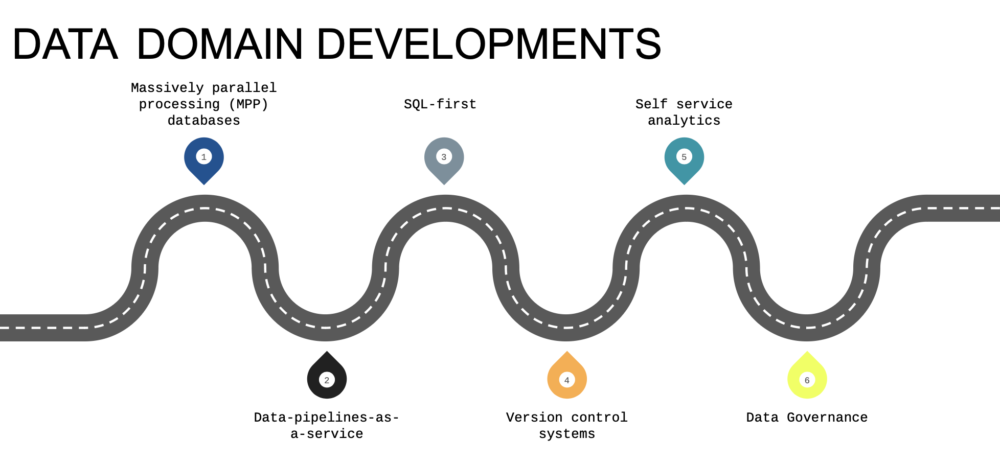

### Kimball’s Dimensional Modeling

Objective
- Deliver data understandable to the business users
- Deliver fast query performance

Approach
Prioritise user understandability and query performance over non redundant data (3NF)

Other approaches
- Bill Inmon 
- Data vault

#### Elements of Dimensional Modeling

Facts tables
- Measurements, metrics or facts
- Corresponds to a business process
- “verbs”

Dimensions tables
- Corresponds to a business entity
- Provides context to a business process
- “nouns”

#### Architecture of Dimensional Modeling
Stage Area
- Contains the raw data
- Not meant to be exposed to everyone

Processing area
- From raw data to data models 
- Focuses in efficiency 
- Ensuring standards

Presentation area
- Final presentation of the data 
- Exposure to business stakeholder

dbt Core
Open-source project that allows the data transformation 
- Builds and runs a dbt project (.sql and .yml files) 
- Includes SQL compilation logic, macros and database adapters 
- Includes a CLI interface to run dbt commands locally
- Opens source and free to use

dbt Cloud
SaaS application to develop and manage dbt projects.
- Web-based IDE and cloud CLI to develop, run and test a dbt project 
- Managed environments
- Jobs orchestration 
- Logging and Alerting 
- Integrated documentation 
- Admin and metadata API
- Semantic Layer

#### Build Models

blue is fact model

#### Macros
- Use control structures (e.g. if statements and for loops) in SQL 
- Use environment variables in your dbt project for production  deployments 
- Operate on the results of one query to generate another query 
- Abstract snippets of SQL into reusable macros — these are  analogous to functions in most programming languages.

#### Packages
- Like libraries in other programming languages
Standalone dbt projects, with models and macros that tackle a specific problem area.
- By adding a package to your project, the package's models and macros will become part of your own project.
- Imported in the packages.yml file and imported by running dbt deps
- A list of useful packages can be find in dbt package https://hub.getdbt.com/

#### Variables
- are useful for defining values that should be used across the project
- With a macro, dbt allows us to provide data to models for compilation
- To use a variable we use the {{ var('...') }} function
- Variables can defined in two ways:
In the dbt_project.yml file
- On the command line

