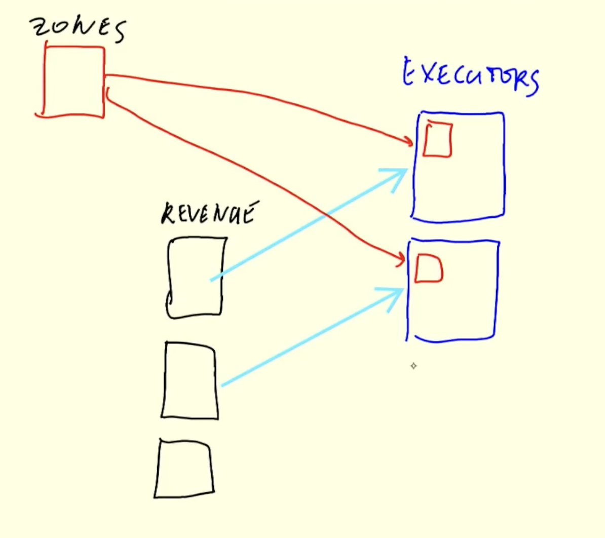

### Batch Processing
- Batch is a processing mode where the data is processed in a finite amount of time. The data is collected over a period of time and then processed. 90%
- Streaming is a processing mode where the data is processed as soon as it is generated. The data is processed in real-time. 10%

Batch jobs:
- Are scheduled to run at specific times.
    - Daily, weekly, monthly, etc.
- Are run on a fixed set of input data.
- Are run on a fixed set of resources.
- Techniques:
    - Python (in Kubernetes and etc)
    - SQL
    - Spark
    - Flink

Lake -> Python -> SQL -> Spark -> Python -> Data Warehouse

Advantages:
- Easy to manage
- Retry and recovery
- Scale
Disadvantages:
- Execution time (data from previous hour is processed in the next hour)
### Spark
Spark is open-source software for big data processing. It is a fast and general-purpose cluster computing system. It provides high-level APIs in Java, Scala, Python, and R, and an optimized engine that supports general execution graphs. It also supports a rich set of higher-level tools including Spark SQL for SQL and structured data processing, MLlib for machine learning, GraphX for graph processing, and Spark Streaming for stream processing.

Lake (s3/gcp .parquet) -> Spark Cluster (Python etc) -> Data Lake
Lake (s3/gcp .parquet) -> Hive, Presto/Athena (SQL) -> Data Lake

PySpark is the Python API for Spark. It is used to work with structured data. It is a high-level API that provides an interface to the Spark framework with programming in Python. It is used to process large datasets. It is used to work with structured data. It is a high-level API that provides an interface to the Spark framework with programming in Python. It is used to process large datasets.

Raw Data -> Lake -> Athen/Presto (SQL) -> Spark (Python/ Train MLM) -> Model -> Spark (Python) -> Data Lake
### Spark/PySpark


RDD is the basic abstraction in Spark. It is an immutable distributed collection of objects. Each dataset in Spark is represented as an RDD. RDDs are created from Hadoop InputFormats (such as HDFS files) or by transforming other RDDs. RDDs support two types of operations: actions and transformations.

Actions and Transformations:
Transformations are operations that are applied to an RDD to create a new RDD. They are lazy operations. They are not executed immediately. They are executed when an action is called. Examples of transformations are map, filter, flatMap, etc.
- selecting
- filtering
- join
- groupBy

Actions are operations that are applied on an RDD, which instructs Spark to perform computation and send the result back to the driver. Examples of actions are collect, count, first, take, etc. Eager operations. They are executed immediately. They trigger the execution of the DAG. They are used to produce a result.
- show
- collect
- count
- take

Pyspark functions
- map

Anatomy of a Spark Cluster

Local setup
```python
from pyspark.sql import SparkSession

spark = SparkSession.builder \
    .master("local[*]") \
    .appName('test') \
    .getOrCreate()
```
In claster we have:
- spark master (port 4040) - entrypoint. Master up and running all the time. It is responsible for scheduling, distributing, and monitoring the jobs.
- executor - worker nodes. They are responsible for executing the tasks that the driver assigns to them.
    - Pull data from s3 or gcs and execute the tasks.
    - Hadoop HDFS pull code and execute the tasks, data is stored in HDFS.


Driver can be local or remote (airflow). It is responsible for submitting the job to the master. It is responsible for scheduling the job to the executor. It is responsible for collecting the result from the executor. It is responsible for monitoring the job.

Group By


Reshuffling in Spark is process of  moving data from one partition to another. It is a costly operation. External Merge sort is used for shuffling. Exchange in schema means reshuffling.


Joins


For small lookup tables we do broadcast join. It is a type of join in which the smaller table is broadcasted to all the nodes of the larger table. It is used when one of the tables is small enough to fit into the memory of the nodes. It is used to avoid shuffling.



#### Connecting to Google Cloud Storage
```bash
gsutil -m cp -r data/pq gs://bucket-name/pq
```