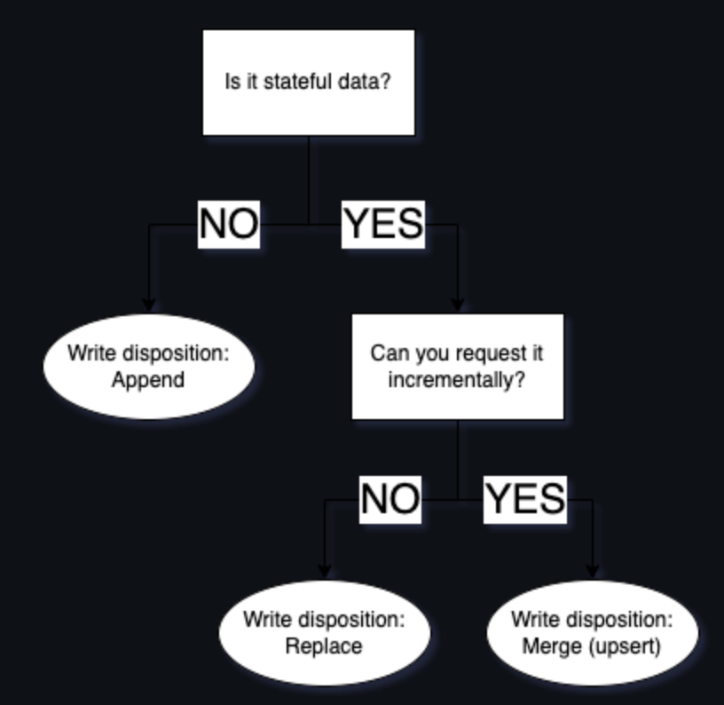

#### data ingestion
- extract data from API or files
- normalize and loading data
- incremental loading

Data ingestion is the process of extracting data from a producer, transporting it to a convenient environment, and preparing it for usage by normalising it, sometimes cleaning, and adding metadata. Process of adding data to lake or warehous. Parquet is almost loaded data, a container.

Here’s what you need to learn to build pipelines

- Extracting data
- Normalising, cleaning, adding metadata such as schema and types
- and Incremental loading, which is vital for fast, cost effective data refreshes.

What else does a data engineer do? What are we not learning, and what are we learning?

- It might seem simplistic, but in fact a data engineer’s main goal is to ensure data flows from source systems to analytical destinations.
- So besides building pipelines, running pipelines and fixing pipelines, a data engineer may also focus on optimising data storage, ensuring data quality and integrity, implementing effective data governance practices, and continuously refining data architecture to meet the evolving needs of the organisation.
- Ultimately, a data engineer's role extends beyond the mechanical aspects of pipeline development, encompassing the strategic management and enhancement of the entire data lifecycle.
- This workshop focuses on building robust, scalable, self maintaining pipelines, with built in governance - in other words, best practices applied.

#### extracting data
Most data is stored behind an API

- Hardware limits: During this course we will cover how to navigate the challenges of managing memory.

    MANAGING MEMORY:
     - In the case of data extraction, the only limits are memory and storage. This refers to the RAM or virtual memory, and the disk, or physical storage.
     - Many data pipelines run on serverless functions or on orchestrators that delegate the workloads to clusters of small workers.
     - The same can be said about disk - in most cases your disk is sufficient, but in some cases it’s not. For those cases, mounting an external drive mapped to a storage bucket is the way to go. Airflow for example supports a “data” folder that is used just like a local folder but can be mapped to a bucket for unlimited capacity.

    AVOID FILLING THE MEMORY - Control the max memory you use. Streaming here refers to processing the data event by event or chunk by chunk instead of doing bulk operations. Stream the data between buffers, such as:
     - from API to local file
     - from webhooks to event queues
     - from event queue (Kafka, SQS) to Bucket

     CLASSIC EXAMPLES OF STREAMING:
     - Between an audio broadcaster and an in-browser audio player
     - Between a server and a local video player
     - Between a smart home device or IoT device and your phone
     - Between google maps and your navigation app
     - Between instagram live and your followers

     STREAMING IN PYTHON VIA GENERATORS:
     To process data in a stream in python, we use generators, which are functions that can return multiple times - by allowing multiple returns, the data can be released as it’s produced, as stream, instead of returning it all at once as a batch.

     Regular function collects data in memory. Here you can see how data is collected row by row in a list called databefore it is returned. This will break if we have more data than memory.
     ```python
     def search_twitter(query):
	data = []
	for row in paginated_get(query):
		data.append(row)
	return data

    # Collect all the cat picture data
    for row in search_twitter("cat pictures"):
        # Once collected, 
        # print row by row
	    print(row)
     ```
     generator
     ```python
     def search_twitter(query):
	    for row in paginated_get(query):
		    yield row

    # Get one row at a time
    for row in extract_data("cat pictures"):
	    # print the row
	    print(row)
        # do something with the row such as cleaning it and writing it to a buffer
	    # continue requesting and printing data
    ```
- Network limits: Sometimes networks can fail. We can’t fix what could go wrong but we can retry network jobs until they succeed.
- Source api limits: Each source might have some limits such as how many requests you can do per second. We would call these “rate limits”. Read each source’s docs carefully to understand how to navigate these obstacles.

